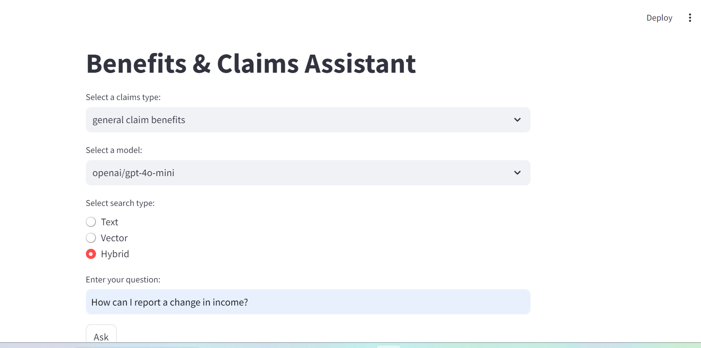

## Table of Contents
- [UK Benefits and Claims Assistant](#uk-benefits-and-claims-assistant)
- [Problem Description](#problem-description)
- [Data](#data)
- [Technologies](#technologies)
- [Usage](#usage)
- [RAG Flow & Implementation](#rag-flow--implementation)
- [Evaluation](#evaluation)
- [Retrieval](#retrieval)
- [Interface](#interface)
- [Data Ingestion](#data-ingestion)
- [Running the Application](#running-the-application)
- [POSTGRES Setup](#postgres-setup)
- [Monitoring](#monitoring)
- [Background](#background)
- [Conclusion](#conclusion)
- [Contributing](#contributing)
- [Future Work](#future-work)
- [Contact](#contact)

## UK Benefits and Claims Assistant

The UK Benefits and Claims Assistant simplifies the process of querying information on various UK benefits and claims, improving accessibility and reducing the time it takes for users to get crucial answers. The integration of AI with a robust dataset enables the tool to serve as a reliable resource for citizens navigating these processes.

## Problem Description

Navigating the complex landscape of the UK benefits and claims system can be overwhelming, especially for individuals who need immediate and accurate information regarding their eligibility or rights. Whether it's updating benefit information, understanding NHS negligence claims, or filing for medical compensation, the system often leaves people with unanswered questions. Delays in receiving this information can lead to missed deadlines, incomplete filings, and unclaimed benefits.

The UK Benefits and Claims Assistant project addresses this issue by providing a user-friendly RAG (Retrieval-Augmented Generation) application. This assistant allows users to ask questions related to UK benefits, claims, and NHS negligence claims. By leveraging a pre-processed dataset and advanced AI models, it offers accurate, real-time answers on various topics like managing existing benefits, Looking for work, Disabled or health condition and Families.



[](./end2end-benefits/benefits-claims/stream_app/data/benefit&claims.mp4)


## Data

The dataset used in this project has been generated and compiled using ChatGPT. It consists of 425 records and is stored in the [data folder](./end2end-benefits/benefits-claims/notebooks/data/) folder. The dataset is structured into four columns:

- category: Enables users to perform searches within a specific category, improving the relevance of search results (e.g., general claim benefits, NHS claim benefits).
- question: Captures the specific inquiries made by users, serving as the primary input for the system to generate relevant answers (e.g., "How do I update my benefit information?").
- answer: Delivers clear, concise, and actionable information to users based on their queries (e.g., "You can update your benefit information online through your account.").
- section: Applies context-based filters to ensure that responses are relevant to the specific section of the claims system (e.g., "general claim benefits" or "NHS claim benefits").

Here’s a snippet of the dataset:

```csv
category,question,answer,section
Manage existing benefit,How do I update my benefit information?,You can update your benefit information online through your account.,general claim benefits
Causation,What is the role of a second opinion in establishing causation?,A second opinion can provide critical evidence in establishing that the initial care was negligent and caused harm.,nhs claim benefits
Limitation,How does the limitation period apply to claims for minors?,The limitation period for minors typically begins when they turn 18 giving them until they are 21 to file a claim.,nhs claim benefits
Temporarily unable to work,How do I claim SSP?,Statutory Sick Pay is claimed through your employer if you’re too ill to work.,general claim benefits
Families,What is the Childcare Grant?,The Childcare Grant is available to students in full-time higher education who have children.,general claim benefits
```

## Technologies

* Minsearch
* Elasticsearch
* OpenAI & Google FlanT5 for LLM
* Streamlit for Interface
* Docker for Containerization
* HuggingFace for Model Embeddings
* Postgres for Database
* Grafana for Monitoring

See Background for more information

## USAGE 

We used pipenv environment for managing dependencies and Python 3.12.

```bash
pip install pipenv
```

```
git clone <https://github.com/ctrl-A-del-specs/benefits-claims>
cd end2end-benefits/benefits-claims
```
Installing dependencies:

```bash
pipenv install
```
Running Jupyter notebook for experiemnts:

```bash
cd notebooks/benefits-claims.ipynb
pipenv run jupyter notebook
```

## RAG Flow & Implementation

RAG Flow
The RAG (Retrieval-Augmented Generation) flow integrates retrieval mechanisms with generative AI models to provide accurate and contextually relevant answers. We implemented a RAG flow using 3 search engines as knowledge base for indexing and retrieving documents - Minsearch, Elasticsearch(Text) and Elasticsearch(Vectorsearch). We also setup a LLM (ChatGpt4o), connected it to our knowledge using a prompt and queried the system. The code implementation for the RAG flow in the folder [benefit-claims](./end2end-benefits/benefits-claims/notebooks/).
Here's an overview of the workflow:

User Input:

The user submits a question through the Streamlit interface.
Retrieval Phase:

Based on the selected search type (Text, Vector, Hybrid), the system queries Elasticsearch to retrieve the most relevant documents from the dataset.
Augmentation Phase:

The retrieved documents are used as context to formulate a prompt for the AI model.
Generation Phase:

The AI model (OpenAI GPT-4o, GPT-4o-mini, or Ollama Phi3) generates a coherent and accurate answer based on the provided context.
Post-Processing:

The generated answer is evaluated for relevance and quality using an additional AI model, ensuring that only the most appropriate responses are presented to the user.
Feedback Loop:

Users can provide feedback on the relevance and accuracy of the answers, which is stored in the database to continually improve the system.


Note to run the elasticsearch,we used a docker container using this code:
```bash
docker run -it \
    --rm \
    --name elasticsearch \
    -m 4GB \
    -p 9200:9200 \
    -p 9300:9300 \
    -e "discovery.type=single-node" \
    -e "xpack.security.enabled=false" \
    docker.elastic.co/elasticsearch/elasticsearch:8.4.3
```

## Evaluation

We generated 2055 questions to evaluate the relevance of answers by some models. The 3 Models were used for evaluating the system were ChatGpt-4o, ChatGpt-4o-mini and Google FlanT5. 
Using Cosine Similarity as an evaluating metric the average score (Mean) of ChatGpt-4o was `79%`, ChatGpt-4o-mini was `80%` and Google FlanT5 was `50%`. The code used for generating data and implementing the evaluation can be viewed at [offline-rag-evaluation](benefits-claims/notebooks/offline-rag-evaluation.ipynb)
After establishing the fact that ChatGpt-4o-mini gave the best average, we also used LLM-as-a-judge to evaluate the answers that were of relevance to the questions generated my the model.
Code implementation details for generating data can be found in the files: [data generation Google FlanT5](./end2end-benefits/benefits-claims/notebooks/huggingface_flan_t5.ipynb) and [data generation OpenAI models](./end2end-benefits/benefits-claims/notebooks/offline-rag-evaluation.ipynb). 

Cosine Similarity - Mean
`ChatGpt-4o-mini - 80%`
`ChatGpt-4o - 79%`
`Google FlanT5 - 50%`

LLM-as-a-judge

ChatGpt4o-mini

`RELEVANT           1916`
`PARTLY_RELEVANT     102`
`NON_RELEVANT         37`

ChatGpt-4o

`RELEVANT           1823`
`PARTLY_RELEVANT     214`
`NON_RELEVANT         18`

Code implementation details for Generating a ground_truth data for evaluation is at [Ground Truth Data Generation](./end2end-benefits/benefits-claims/notebooks/ground_truth.ipynb)

## Retrieval

 We implementated an evaluation of the retrieval of answers from the 3 search engines used (Minsearch, Textsearch and Vectorsearch). The evaluation was carried out using 2 metrics, Hitrate and Mean Recriprocal Rank. Without any boosting, these are the results:
 Minsearch:                   After Boosting
 `hitrate: 91%, MRR: 64%`     `hitrate: 95%, MRR: 73%`
Textsearch:
`hitrate: 77%, MRR: 62%`      `hitrate: 92%, MRR: 72%`
Vectorsearch:
Question Vector - 
`hitrate: 86%, MRR: 74%`
Answer Vector - 
`hitrate: 82%, MRR: 69%`
Hybridsearch - 
`hitrate: 92%, MRR: 80%`
Question Answer Vector -
`hitrate: 93%, MRR: 81%`     `hitrate: 96%, MRR: 82%`
Best Parameters -
` k: 23, num_candidates: 9000`

The code for implementing retieval can be found: [hyperparameter](benefits-claims/notebooks/hyperparameter.ipynb)

## Interface

We created a simple interface using Streamlit to interact with the system. Code implementation can be found here [benefits-claims](benefits-claims/generate_data/qa.py)

### Testing
Head to the streamlit app on your browser: [streamlit](http://localhost:8501/)

Input parameters

Enter your query: "How can i update my benefits information?"
Enter the section: (e.g., benefits, nhs-claims)

## Data Ingestion

This script automates the ingestion of claims, documents, and ground truth data into a PostgreSQL database for the UK Benefits and Claims Assistant. It reads data from CSV and JSON files, processes them using Pandas, and loads them into corresponding PostgreSQL tables.

### Features

- Database Connection: Establishes a connection to a PostgreSQL database using credentials loaded from environment variables.
- Data Loading: 
  - Reads claims data from a CSV file.
  - Loads document data from a JSON file.
  - Ingests ground truth data from a CSV file.
- Data Ingestion: The script ingests data into PostgreSQL, replacing any existing data in the specified tables.


### Environment Variables

The script loads the following environment variables from a `.env` file:

```env
POSTGRES_USER=your_username
POSTGRES_PASSWORD=your_password
POSTGRES_HOST=your_host
POSTGRES_PORT=5432
POSTGRES_DB=your_db
```

### Usage

- `claims_data_path`: Path to the claims CSV file.
- `document_data_path`: Path to the JSON file with document data.
- `ground_truth_data_path`: Path to the ground truth CSV file.

Run the script:
    ```bash
    pipenv run python data_ingestion.py
    ```

The data is being ingested into the following PostgreSQL tables:
   - `claims`
   - `documents`
   - `ground_truth`


## Running the Application
We initialize the PostgresSql, Streamlit, and Elasticsearch using the setup in the docker-compose file [Docker Compose](./end2end-benefits/benefits-claims/stream_app/app/docker-compose.yml) that starts the application. Next we ingest data, index the data into elasticsearch and setup connection to the database.
Application codes can be view [Benefits&Claims - Streamlit](./end2end-benefits/benefits-claims/stream_app/)

```bash
python data-ingestion.py
export POSTGRES="localhost"
python prep.py
```
```bash

## POSTGRES Setup

Install pgcli

```bash
python pipenv install pgcli
```
### Connecting to POSTGRES using pgcl

```bash
pgcli -h localhost -U your_username -d benefit_claims -W
```
Input your_name and your_password

Common commands
```bash
\c
\dt
select * from conversations;
select * from feedbacks;
```
Initialize the Database:

Ensure that your PostgreSQL server is running and the environment variables are correctly set in a .env file.

The full application will now be up and running, and you can access it via `localhost`.

## Monitoring

We utilised grafana to monitor the application. We visualize query response times, API calls, and OpenAI costs then displayed and exported dashboard as a `json` file.Dashboard can be viewed here [Grafana Dashboard](./end2end-benefits/benefits-claims/stream_app/data/benefit_claims_dashboard.json)

Run Grafana:
    ```bash
    docker run -d -p 3000:3000 --name=grafana grafana/grafana
    ```

Access Grafana: Go to `http://localhost:3000` (default login: admin/admin).
 Queries Used are :

Response Time
```bash
SELECT
  timestamp AS time,
  response_time
FROM conversations
ORDER BY timestamp
```

Feedback Statistics
```bash
SELECT
  SUM(CASE WHEN feedback > 0 THEN 1 ELSE 0 END) as thumbs_up,
  SUM(CASE WHEN feedback < 0 THEN 1 ELSE 0 END) as thumbs_down
FROM feedback
```

OpenAI Cost
```bash
SELECT
  timestamp AS time,
  openai_cost
FROM conversations
WHERE openai_cost > 0
ORDER BY timestamp
```

Model Usage
```bash
SELECT
  model_used,
  COUNT(*) as count
FROM conversations
GROUP BY model_used
```

Recent Conversations
```bash
SELECT
  timestamp AS time,
  question,
  answer,
  relevance
FROM conversations
ORDER BY timestamp DESC
LIMIT 5
```

Relevance Distribution
```bash
SELECT
  relevance,
  COUNT(*) as count
FROM conversations
GROUP BY relevance
```

We generate data using a python to visualize more information on the grafana dashboard using this: [grafana data](./end2end-benefits/benefits-claims/stream_app/app/generate_data.py)

## Background

### Technologies Used:

### [Streamlit](https://streamlit.io/)

Streamlit is an open-source Python framework used to create interactive and visually appealing web applications for machine learning and data science projects. It enables rapid development and deployment of user-friendly interfaces with minimal coding effort.

### [Elasticsearch](https://www.elastic.co/elasticsearch)

Elasticsearch is a distributed, RESTful search and analytics engine designed for horizontal scalability, reliability, and real-time search capabilities. It is utilized in this project to efficiently index and retrieve relevant documents based on user queries, enhancing the application's search functionality.
* [Minsearch](https://github.com/DataTalksClub/llm-zoomcamp/blob/main/01-intro/minsearch.py)
* [Elasticsearch](https://www.elastic.co/guide/en/elasticsearch/reference/current/rest-apis.html)

### [SentenceTransformers](https://sbert.net/)

SentenceTransformers is a Python library that provides an easy way to compute dense vector representations (embeddings) for sentences and texts. These embeddings are crucial for semantic search and similarity comparisons, enabling the Retrieval-Augmented Generation (RAG) system to understand and retrieve contextually relevant information.

### [OpenAI API](https://platform.openai.com/docs/overview) & [Google FlanT5 for LLM](https://huggingface.co/docs/transformers/en/model_doc/flan-t5)

The OpenAI API offers access to advanced language models like GPT-3.5-Turbo and GPT-4o. These models are integral to generating coherent and contextually accurate answers based on retrieved information, powering the generative component of the RAG system.

### [PostgreSQL](https://www.postgresql.org/)

PostgreSQL is a powerful, open-source relational database system known for its robustness and scalability. It is used in this project to store conversations, feedback, and other relevant data, ensuring efficient data management and retrieval.

### [Jupyter Notebook](https://jupyter.org/)

Jupyter Notebook is an open-source web application that allows for the creation and sharing of documents containing live code, equations, visualizations, and narrative text. It is employed in this project for experimentation, data analysis, and developing AI models. We used this to carryout experiments and select the best approach to creating the final application.

## [Pipenv](https://pipenv.pypa.io/en/latest/)

Pipenv is a dependency management tool for Python that combines Pipfile, Pipfile.lock, and virtual environments into a single workflow. It ensures consistent and reproducible environments across different development setups, simplifying the installation and management of project dependencies.Our project was created in a pipenv environment and all dependencies stored accordingly.

## [Docker](https://docs.docker.com/compose/)

Docker is a platform that enables the creation, deployment, and running of applications within containers. Containers package software with all its dependencies, ensuring that applications run consistently across various environments. Docker is used to containerize the Streamlit application and its dependencies, facilitating seamless deployment. We used docker-compose to launch and run the streamlit, postgres, grafana and elasticsearch applications.

## [Psycopg2](https://pypi.org/project/psycopg2/)

Psycopg2 is a PostgreSQL adapter for Python. It allows Python applications to connect to and interact with PostgreSQL databases, enabling efficient execution of SQL queries and management of database transactions.

## [Dotenv](https://pypi.org/project/python-dotenv/)

Dotenv is a tool for managing environment variables in Python applications. It loads environment variables from a `.env` file into the application's environment, allowing for secure and flexible configuration of sensitive information like database credentials and API keys. Variable for grafana, streamlit, openai, elasticsearch, model name and index name were stored in the `.env` file.

### [Grafana](https://grafana.com/)

Grafana is used to monitor the performance and health of the UK Benefits and Claims Assistant. It provides real-time data visualization and insights on system metrics, API costs, and query performance.

- Real-Time Monitoring: Track system metrics, query response times, and API usage in real-time.
- Custom Dashboards: Create visual dashboards to monitor various aspects like API costs, Elasticsearch query performance, and PostgreSQL health.

## Conclusion
This assistant tool demonstrates the potential of AI in making complex benefits and claims systems more accessible. By integrating RAG, LLMs, and robust search technologies, the application provides users with relevant and timely information that can significantly improve their experience.

## Contributing

Contributions are welcome! Please follow these steps to contribute:

Fork the Repository
Create a Feature Branch
Commit Your Changes
Push to the Branch
Open a Pull Request

## Future Work
- Expand the dataset to cover more specific scenarios, especially within the NHS claims domain.
- Refine the hybrid search functionality to improve MRR.
- Incorporate real-time feedback mechanisms for further system improvement.

## Contact
For any questions or suggestions, please contact kayalade007@gmail.com. 